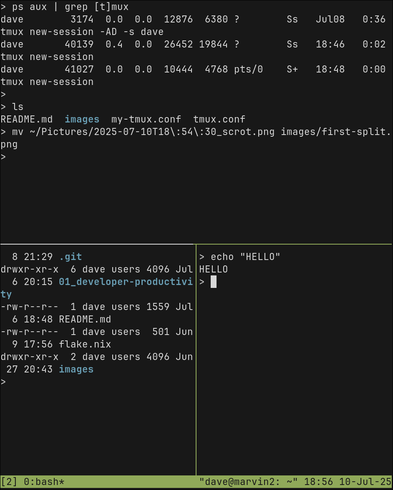
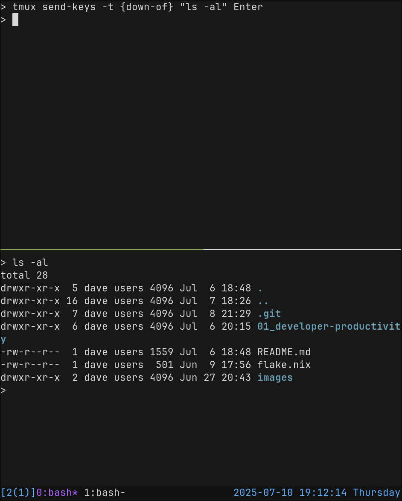

# Developer Productivity 04 - `tmux`

TODO: split this into 2 or 3 chapters

## Overview

Don't struggle managing multiple terminal windows manually. Manage them with layouts so you can view them side-by-side, in a grid, or jump between the with a key press.

All of the terminals that you open in your layout will be saved to the active `session`. If you close your terminal window (or if you disconnect from a remote host using `tmux`), then you can re-attach to that `tmux` session and pick up exactly where you left off.


There are a lot of keybindings and commands, but you really only need to know a few to use `tmux` effectively. You may want to use a [cheat-sheet](https://tmuxreference.com/) as a quick reference.

From the `tmux` manual pages:

> tmux is a terminal multiplexer: it enables a number of terminals
> to be created, accessed, and controlled from a single screen.
> tmux may be detached from a screen and continue running in the
> background, then later reattached.

Terms:

- `prefix` - The `prefix` is the special key combination that must occur before any tmux commands. For example, `Ctrl+a` quickly followed by `?` to open the help menu.
- `Terminal multiplexer` - Manages multiple 'pseudo terminals' inside of one virtual terminal.
- `Session` - A single collection of terminals under management of `tmux`.
- `Window` - The visible 'screen' showing an arrangement of one or more terminals. A window can be split into multiple `panes`, and manages arrangement of those `panes`.
- `Pane` - One terminal in a layout. `Panes` can be arranged in a `window` or moved to other `windows` on the same `session`.

## Exploring the Examples

Keep your shell open on one half of the screen, and this document in your browser on the other half.


Follow along with the exercises by typing commands in your terminal and interacting with `tmux`, as instructed.

## Installing

Install with your package manager (`homebrew`, `dnf`, `pacman`, etc.).

If you have any issues, there is an [Installation Guide](https://github.com/tmux/tmux/wiki/Installing).

The configuration file can be found at `~/.tmux.conf` or `~/.config/tmux/tmux.conf`. If the file do not exist, you can just create an empty one.

We will start with the default configuration and then we'll see how to customize it later.

## Sessions, Windows, Panes

Follow along with the commands as you read and we'll walk through the basics.

First, start `tmux` from your terminal:

```zsh
tmux
```

You have just started a new `session`. If you disconnect from this `session`, or accidentally close your terminal, you will be able to re-attach and continue on.

Now, instead of looking at a regular terminal, you are looking at a new `window` that has one `pane`, which takes up the whole screen. The `window` is like a "page" or a "tab", and on that `window` we can create and arrange multiple other `panes` to create a layout and navigate between terminal instances.

At the bottom of the screen, you should see the `statusbar` and a "tab" with the name of your current `session`. As you open more windows, they will be added to the `statusbar` and the active `window` will have an asterisk `*` by it's name.


### The `prefix`

Entering commands in `tmux` is a little different than what you may be used to. To interact with `tmux`, you use a short sequence of key combinations. Every command starts with a common `prefix` key(s), which is the signal to `tmux` that the _next_ key combination is the command to execute.

The default keybinding for the `prefix` is `Ctrl+b` (or possibly `Ctrl+a` in some systems). After you enter the `prefix` sequence, then you have a short window to enter your actual command.

For example, split the current `horizontally`:

1. `Ctrl+b` (or whatever your `prefix` is)
2. `"`

If you did it correctly, you should see the screen now split into two equal-sized terminals.


The notation that `tmux` uses for this command is written like `C-b "`. Since the `prefix` is used for every command, it is frequently just omitted from the documentation, so this example would just be `"` and you would know that you have to type the `prefix` first.

### `sessions`, `windows`, and `panes`

Now that you have two `panes` open, move between them with `prefix` and then one of the arrow keys. If you created a new window below, that would be `C-b ↓`. To move back up, you can use `C-b ↑`. You could also use `C-b ;` to move to the "previous" `pane`.

Now move to the bottom pane and open a new vertical split:

1. `C-b ↓` to move down.
2. `C-b %` to make a vertical split.



To close one of the panes, first move to it and then run `exit` at your command line, or use `Ctrl+d` to do the same thing.

Try moving the split that you just created and close it:

1. `C-b →` to move to the right pane.
2. `Ctrl+d` to exit the shell.

When every `pane` has been closed, then the `window` is terminated. When every `window` is terminated, then `tmux` will exit.

The other way to exit is to run the `detach` command. Try detaching from your session now, by pressing `C-b d`. This should drop you back to your original shell from before you launched `tmux`.

Now close and quit out of your terminal emulator window and open a fresh one, and try the following commands:

1. `tmux ls` to list the active sessions.
2. `tmux attach` to attach to the session we started earlier.

You can have multiple sessions for different tasks/projects and switch between them. You can also run `tmux` on a server or shared host, where you can have multiple people connected to the same `session` from different clients, and everyone can see the same things and interact at the same time. This is a good way to do pair programming from the command line with a remote team.

Back at our `tmux` session, try creating a new `window` and moving between them:

1. `C-b c` to create a new window.
2. `C-b n` to move to the next (right) window.
3. `C-b p` to move back to the left window.
4. `C-b l` to move to the previous (last) window.

The "names" of the windows are printed on the status line. `tmux` will try to determine what program is running in that `window` and chose a name automatically, but you can name the windows yourself to keep organized by using `C-b ,`.

Try renaming your first `window` to "SHELL" and the second `window` to "EDITOR".

### Resizing

Now create a couple of split `panes` on one of the `windows` and we'll resize them to create the layout that you want.

1. Create a couple of splits with `C-b "` and `C-b %`.
2. Move to the top-left pane with `C-b ←` and `C-b ↑`.
3. Resize the current `pane` vertically with `C-b Alt-↓` and/or `C-b Alt-↑`.
    1. TIP: After you hit `C-b Alt-↓` the first time, hold `alt` and press `↓` repeatedly.
    2. You only have a second between key presses before it will exit command mode and you have to start again.
4. Resize horizontally with `C-b Alt-→` and `C-b Alt-←`.

One more very useful feature is `zoom`. When your current `window` is split into multiple `panes`, you can zoom-in and make one `pane` full-screen temporarily.

1. Navigate to one of your split `panes`.
2. `C-b z` to zoom-in.
3. `C-b z` again when you want to zoom-out.

There are a lot more commands to do things like rotate your layout, split a pane into its own window or join and merge panes from other windows, etc. But the commands covered here should be enough to do most of what you need.

## Configuring

You can copy the provided configuration file to `~.tmux.conf` or `~/.config/tmux/tmux.conf` and use it directly. It's a pretty standard configuration and it's short enough that we can walk through the whole thing, and you can change it to your taste.

Start by `sourcing` the [Example tmux.conf](./tmux.conf) into your current session:

1. Copy the example config file to `~/.tmux.conf` (or `~/.config/tmux/tmux.conf`). 
2. In your open session, execute `C-b :` to bring up the command prompt.
3. Type `source-file ~/.tmux.conf` and press `Enter`/`Return` to activate that configuration.

> IMPORTANT NOTE: This config changes the `prefix` to `C-a`. Keep that in mind as you continue so you can translate any examples to the correct sequence.

The first customization I always make is to re-bind the `prefix` key. By default, it's `C-b` (Ctrl+b). That's kind of awkward to type, and feels like it's probably bad for your wrist (on a US QWERTY keyboard).

You may like to re-bind the `prefix` to something like `C-a` or even "\`" (backtick).

```tmux
unbind C-b
set -g prefix C-a
bind C-a send-prefix
```

Using `C-a` is a little more comfortable, doesn't typically conflict with other common keybindings, and matches the `prefix` idiom used by `gnu-screen`.

The idea behind using "\`" was that it was a single-key prefix, which makes it easy to type, and it's rarely typed in day-to-day work. If you do need to use it, you can hit "\`" twice in a row. However, I find myself writing a lot more `markdown` with code sections, or other applications where I actually need to use "\`". So I typically use `C-a` myself.

I also like to bind a key to `source` the configuration file to apply recent changes:

```tmux
unbind r
bind r source-file ~/.config/tmux/tmux.conf
```

I disable support for mouse selection and input, set the clock to 24-hour format, and set a large history limit. You may want to customize these:

```tmux
set  -g mouse             off
setw -g clock-mode-style  24
set  -g history-limit     50000

```

### Status Line

The `tmux` status-line shows a list of active windows in your session, and indicates which one is selected.

It can also be configured to show useful information about your command, session, or system environment.

```tmux
set -g status-style bg='#111111',fg='#676E7D'
set -g status-interval 1
set -g status-left '[#{session_name}] '
set -g status-right '%Y-%m-%d %T %A'
set-option -g status-position bottom
```


#### Format String

If you've ever configured a prompt-string for your shell, then you know how this works. Of course, `tmux` has it's own system and syntax, different from that of `zsh`. But, just like configuring your `zsh` prompt, you probably only need to do it one time, and it's not actually very hard.

You still supply a format-string, and certain characters and escape sequences will be replaced when the status line is rendered.

[Reference manual](https://www.man7.org/linux/man-pages/man1/tmux.1.html#FORMATS)

- Format variables are enclosed in `#{ ... }`. Example: `#{session_name}` would be replaced with the name of the current session.
- There is a ternary operator `${?VAR,TRUE,FALSE}`. Example: `#{?window_zoomed_flag,🔍,}` would show a magnifying glass icon if `zoom mode` is active, or nothing otherwise.
- Shell commands can be included in `#( ... )`. Example: `#(uptime)` would run the `uptime` command and render the output.
- Style sections of the status line with `#[STYLES]`. Example: `#[fg=FFFFFF bg=000000 bold]` would change the style to white foreground and black background, with bold text.
- Use the style `default` to reset to the default `status-style` colors from your configuration. Example: `#[default]`.

Show current date and day of the week, in a blue color:

```tmux
set -g status-right '#[fg=#4EA1FF]%Y-%m-%d %T %A'
# you might need to make the section max-width to make room
set -g status-right-length 40
```

Show the name of the current session (`#S`), the number of clients connected to the session in parentheses, in blue text. And show a magnifying glass on the left when `zoom mode` is active:

```tmux
set -g status-left '#[fg=#4EA1FF]#{?window_zoomed_flag,🔍,}[#S(#{session_attached})]'
# you might need to make the section max-width to make room
set -g status-right-length 20
```


The default styles and colors are set by the `status-style` option. When you use `#{default}` to reset styles, this is what it will use as the default.

You can also set a different style for the active session "tab" on the status line with `window-status-current-style`.

```tmux
set-option -g window-status-current-style fg=#BD5EFF
```


## `tmux-send-keys`

You can run a command from one shell, and have `tmux` type the arguments into another pane.

This is a cool trick and can be very useful for scripting or making custom keybindings to coordinate things between multiple panes.

1. Make sure you have at least one vertical split on your open `window` (`prefix "`).
2. Navigate to the top pane with `prefix ↑`.
3. Type the following command at the terminal:

```zsh
tmux send-keys -t {down-of} "ls -al" Enter
```



## Plugins and Alternatives

There are plugins for `tmux`, and even plugin managers. I've never used a `tmux` plugin myself but, if you are interested, [here is a list](https://github.com/tmux-plugins/list).

There are a few alternatives to `tmux` that are worth mentioning:

- `gnu-screen` (`screen`) is an older terminal multiplexer. It has fewer features, and doesn't support splitting screens into multiple `panes`, but you can have multiple `windows` and you can detach and re-attach to sessions. It's frequently found on development servers, where you connect remotely via `ssh`. If you work from within `screen`, then you can resume your session if the network connection is cut-off, or allow other users to join your session and pair.
- [`zellij`](https://github.com/zellij-org/zellij) is a newer, rust-based "workspace manager" that has many of the same features as `tmux`. I've never used it, but it seems to be quite popular.
- [`ghostty`](https://ghostty.org/) is a brand new terminal emulator that also allows you to make splits and `windows`, but no support for `sessions` yet.

I prefer to use a terminal emulator that doesn't have splits or windows, like [kitty](https://sw.kovidgoyal.net/kitty/), and use that with `tmux` for layout management.

## References:

- `man tmux`
- https://github.com/tmux/tmux/wiki
- https://github.com/tmux/tmux/wiki/Installing
- https://github.com/tmux/tmux/wiki/Getting-Started
- https://tmuxreference.com/
