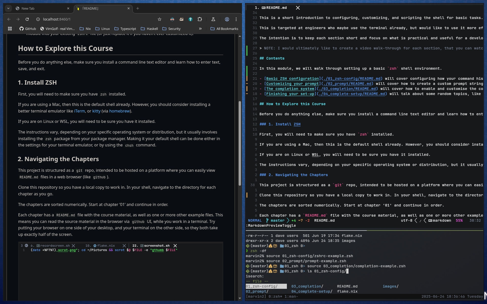

# DaveLab 01 - Configuring ZSH For Everyday Use

## Objective

By the end of this module, you will have created your own customized `zshrc` file that you can use to replace/augment your existing configuration, to make it much easier to perform tasks in the shell. Importantly, you will know what every option in that configuration file does and how to change it.

## Contents

In this module, we will walk through setting up a basic `zsh` shell environment.

- [Basic ZSH configuration](./01_zsh-config/README.md) will cover configuring how your command history works, and adjusting some global settings.
- [Customizing your prompt](./02_prompt/README.md) will cover how to create a custom prompt string, and we'll talk about prompt generators and other tools that might automate the process for you.
- [The completion system](./03_completion/README.md) will cover how to enable and customise the completion engine, which will help you enter commands correctly by showing you the valid options and letting you pick from a menu.
- [Finishing your set-up](./04_complete-setup/README.md) will talk about some random topics, like plugins, plugin managers, and other shells you might find interesting. Then we'll cover how to merge the final `zshrc` that we made in this module into your existing `zshrc` file (or just replace it if you haven't ever customized it).

## How to Explore this Course

Before you do anything else, make sure you install a command line text editor and learn how to enter text, save, and exit.

### 1. Install ZSH

First, you will need to make sure you have `zsh` installed.

If you are using a Mac, then this is the default shell already. However, you should consider installing a better terminal emulator like [iTerm](https://iterm2.com/), or [kitty](https://github.com/kovidgoyal/kitty) (via [homebrew](https://brew.sh/)).

If you are on Linux or WSL, you will need to be sure you have it installed.

The instructions vary, depending on your specific operating system or distribution, but it usually involves installing the `zsh` package from your package manager. Making it your default shell can be done either in the settings for your terminal emulator, or by using the `chsh` command.

### 2. Navigating the Chapters

This project is structured as a `git` repo, intended to be hosted on a platform where you can easily view `README.md` files in a web browser (like `github`).

Clone this repository so you have a local copy to work in. In your shell, navigate to the directory for each chapter as you go.

The chapters are sorted numerically. Start at chapter '01' and continue in order.

Each chapter has a `README.md` file with the course material, as well as one or more other example files. This means you can read the source material in the browser via `github` UI, while you work in a terminal. Try putting your browser on one side of your desktop, and your terminal on the other side, so they both take up exactly half of the screen.



Each section will briefly cover the material, then explain how you can try it out and experiment.

### 3. Running the Examples

We can test configuration files and shell scripts by starting a fresh `zsh` session in your terminal. This will ensure we're working from a clean slate, with zero custom configuration, so we can experiment with changing settings and be sure scripts and commands will work consistently.

To start, open your terminal emulator and start a new `zsh` session:

```zsh
zsh -df
```

You may notice the prompt change to the default, which is just your system's hostname and a '%' character.

Then you can `source` the configuration file that you want to test:

```zsh
source example_config.zsh
```

You can `source` your file again if you need to apply changes, or you can `exit` to go back to the shell environment from before you typed `zsh -df`.
