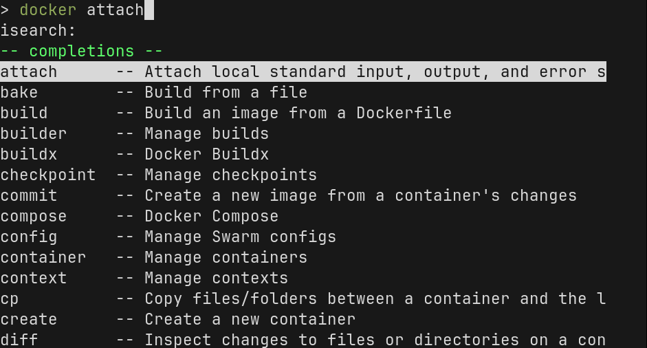
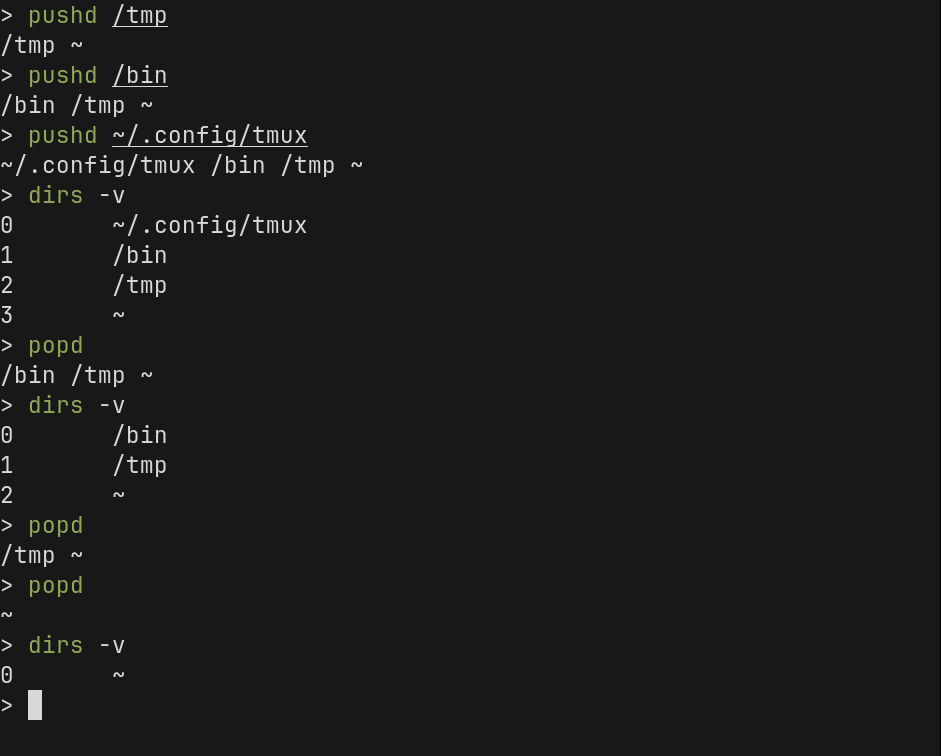

# Developer Productivity 02 - Finding Help and Some Misc. Tips

## Finding Help

There are a lot of commands, and every command has options and required parameters. The commands you use every day will become muscle memory, but you will always need to look things up to find help or remember the options you need to use.

### `man` - The Manual Pages

The first place you should look is the manual pages. Most commands have manual pages that tell you all about the command, how it works, what are the parameters and options, known bugs, and often times they will have examples of how to use them.

To view the help for the `ls` command:

```zsh
man ls
```


You can move up and down in the document using the arrow keys (`↓`/`↑`) or `vim` keys `j`/`k`.

You can move down by one page with `space`.

You can search through the document by typing `/` and then entering your search term. For example, if you want to search to see what the `-X` option does, you would type `/-X`.

When you want to quit, press `q`.

Press `h` to view the help menu to see all the commands you can use.

## Command Help

If you know how to use the command but you need a quick reference, use the command's help option.

By convention, most commands and programs should have a help menu. You can usually see this by typing the command with either `-h` or `--help` as the parameter.

```zsh
ssh --help
```

Not every command has a help menu, but most do.

### Using `zsh` Autocomplete

If you completed the [`zsh` configuration](../../01_zsh-configuration/README.md) module, then you should have enabled and configured autocompletion.

If you already know the command but just can't remember the arguments or commands, you can often use this to just `<tab>` complete your way to typing out the command.



### Searching the Internet

I put this last because I think you should try to use the built-in help systems first.

In recent years, Google search results for have gone down in quality and it becomes harder and harder to find the information you are looking for under all of the ads and paid search results. But, for most queries, it should still find what you need on StackOverflow or other answers sites.

## Using your History

When you use the shell every day, most commands you need are already in your history. There are a few tricks you can use that will allow you to quickly retrieve specific commands from your history.

You can also rely on your history as a log of the sequence of commands you used to accomplish a task, that you need to repeat over and over.

### Reverse-Incremental Search

The first time I saw someone using this feature, I thought they must be a wizard. They were entering commands so fast, and using far fewer keystrokes than you'd need to type them all out.

But it's not really magic, he was just (very efficiently) searching through his history and entering commands that he had already previously run.

To use this feature, press `Ctrl+r` at the prompt.


Now if you start typing, it will keep updating the command line with the best match, searching backwards through your history, for entries that contain your search term as a substring.


You can keep typing to refine your command, or you can use `Ctrl+r` and `Ctrl+Shift+r` to move forward and backwards through the other matches for your prompt.

If you want to run the command, hit `Enter`/`Return`.

If you want to cancel, hit `Ctrl+c`.

If you want to edit the current selection before running it, use the left or right arrow keys to move around.

## `zsh` Plugins

### `zsh-history-substring-search`

The [`zsh-history-substring-search` plugin](../../01_zsh-configuration/04_complete-setup) works like `Ctrl-r` but is a little more beginner friendly for most people.

To use it, just type any substring/part of the command you want to summon from the history, and then press the "up" arrow (`↑`).

If you want to cycle through more matches, you can cycle to the next match by pressing `↑` again, and you can go back with the "down" arrow (`↓`).

This is less powerful than `Ctrl-r` because, once you hit the arrow key, you can't continue typing to further refine your search. You have to cycle up/down, one entry at a time, based on the search string you already entered.

### `zsh-autosuggestions`

The [`zsh-autosuggestions` plugin](../../01_zsh-configuration/04_complete-setup) will show an in-line "autocomplete" placeholder, with the most recent command from your history that would complete what you have typed so far:


If you want to accept the suggestion, use the right arrow key (`→`).

## Replaying Sequences of Commands

I'm not sure if everyone would consider this good advice, but it's sometimes very convenient to just repeat a series of steps by cycling up through your command history by a fixed number of entries, and re-running each one in sequence.

For example, if you had to repeat this operation, over and over, to test your code:

1. Export your `mysql` database using `mysqldump` and save it to `/tmp`
2. Run a script to bootstrap a new copy of your database.
3. Run a script or command to populate the database according to some test criteria.
4. Export the `mysql` database again, to a second location.
5. `diff` the two database dumps.

A sequence of 5 commands, which you can repeat over and over without changing them.

After you finish running the sequence, and you want to repeat it, just hit the "up" arrow (`↑`) 5 times to retrieve the command for step one.

Once you run that command, it will now be at the bottom of your history list, which means that now step two is 5 commands back in your history. Press `↑` five more times and run it. Repeat until you've completed the sequence, hitting `↑` 5 times each time to run the next command.

This is convenient, and I do it all the time, but it may not be ideal:

- If you enter something in between commands, you can throw off the '5x' offset and mess up your sequence very easily.
- You might start moving too quickly and run the wrong commands out of sequence.
- Your history file might get truncated and you lose this history.

Once you've done this a few times, you should probably create a [simple script](../../03_basic-shell-scripting/README.md) instead.

## Using `pushd`/`popd`

Sometimes you may need to temporarily change to a different directory and run a few commands, but you don't want to lose your spot. If you use `pushd` and `popd`, you can save your place in a "stack" of directory bookmarks and then return to them when you are done.

Use `pushd` to move to a new directory and save your place on the `dirs` stack. Try the following sequence of commands:

```zsh
cd ~
pushd /tmp
touch test.txt
dirs -v
popd
```



You can put something in your [prompt string](../../01_zsh-configuration/02_prompt/README.md) to show how many levels of directories are on the stack:

```zsh
$(dirs -v | wc -l | xargs)
```

## Entering Multiple Commands at Once

You can enter multiple commands at once using the `;` (semi-colon) character to separate commands:

```zsh
cd /tmp ; ls
```

This would change directory to `/tmp` and immediately print out it's contents.

If you want to run a command ONLY if the previous command succeeded, you can use `&&`:

```zsh
find . -name '*.txt' && echo "FOUND TEXT FILES"
```

If any text file were found under the current directory, then print the text "FOUND TEXT FILES". If no matches were found, then the second command will not be executed.

You can also use `||` to "or" two commands together: run the second command if the first command _fails_:

```
find . -name '*.txt' || echo "NO TEXT FILES!"
```

Similar to the previous example, this would print "NO TEXT FILES!" if the `find` command failed to find any text files.

> NOTE: These conditions are based on the exit code of the previous command. If a command succeeds, then it returns an exit code of 0, to mean no errors. If the command fails, then it returns a non-zero value to indicate the error.
> This means that TRUE=0 and FALSE=(not 0). This is important to keep in mind, but it won't affect you when you are simply combining two commands because the logical `&&` and `||` operators hide the details and you can just focus on the high-level logic.

---

[NEXT >>](../02_expansion-signals/README.md)
