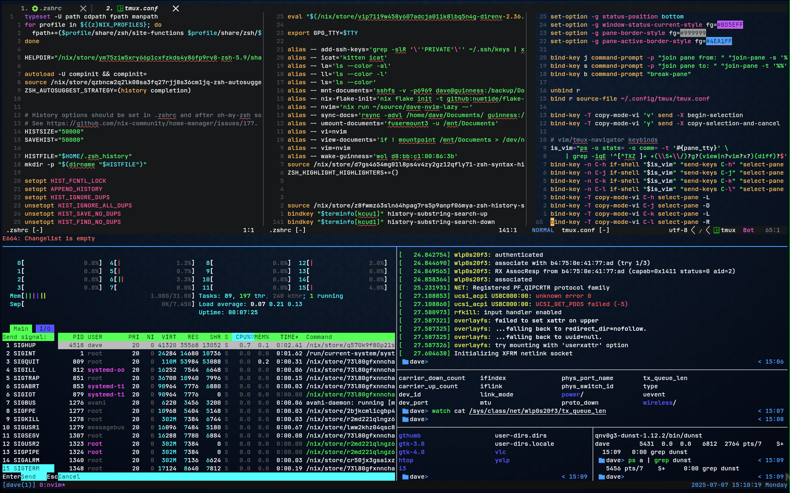

# Developer Productivity 04 - `tmux`

## Overview

Don't struggle managing multiple terminal windows manually. Manage them with layouts so you can view them side-by-side, in a grid, or jump between the with a key press.

All of the terminals that you open in your layout will be saved to the active `session`. If you close your terminal window (or if you disconnect from a remote host using `tmux`), then you can re-attach to that `tmux` session and pick up exactly where you left off.

## Exploring the Examples

Keep your shell open on one half of the screen, and this document in your browser on the other half.

Follow along with the exercises by typing commands in your terminal and interacting with `tmux`, as instructed.

## Installing

Install with your package manager (`homebrew`, `dnf`, `pacman`, etc.).

If you have any issues, there is an [Installation Guide](https://github.com/tmux/tmux/wiki/Installing).

The configuration file can be found at `~/.tmux.conf` or `~/.config/tmux/tmux.conf`. If the file do not exist, you can just create an empty one.

We will start with the default configuration and then we'll see how to customize it later.

## Contents

- [Basic `tmux` usage](./01_basic-usage/README.md) will cover the basics of how to start, stop, and manage layouts.
- [Configuration](./02_configuration/README.md) will cover how to configure and customize `tmux`.

---

[NEXT >>](./01_basic-usage/README.md)
