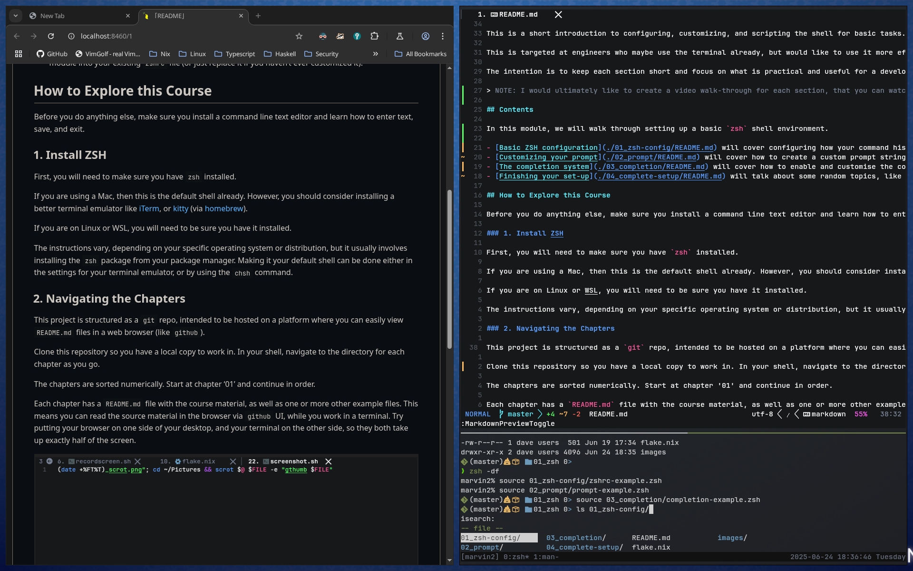

# DaveLab

## Overview

Short, guided crash-courses for important every day skills.

Each course is made of a small number of short sections (around 20 minutes each).

Each section includes a `README.md` file with the course material and any relevant source code or resource files.

These lessons are intended to be interactive - work along in your terminal and do the examples as you read.

These short chapters can't teach you everything you need to be an expert. They will only cover the enough to get you off the ground, and give you an idea of how/why the topic is useful to you.

## Navigating the Chapters

This project is structured as a `git` repo, intended to be hosted on a platform where you can easily view `README.md` files in a web browser (like `github`).

Clone this repository so you have a local copy to work in. In your shell, navigate to the directory for each chapter as you go.

The chapters are sorted numerically. Start at chapter '01' and continue in order.

Each chapter has a `README.md` file with the course material, as well as one or more other example files. This means you can read the source material in the browser, via `github` UI, while you work in a terminal. Try putting your browser on one side of your desktop, and your terminal on the other side, so they both take up exactly half of the screen.

Each section will briefly cover the material, then explain how you can try it out and experiment.

## Contents

> NOTE: Only the ZSH Configuration and `tmux` sections are mostly done. The others are WIP - they have some of the raw content but aren't ready yet.

- [ZSH Configuration](./01_zsh-configuration/README.md) - How to configure your `zsh` shell into something that makes it comfortable, visually appealing, and easier to use.
- (WIP) [Using the Shell](./02_using-the-shell/README.md) - How to accomplish common daily tasks by combining commands, some of the most useful, general commands, and some real world examples.
- (WIP) [Basic Shell Scripting](./03_basic-shell-scripting/README.md) - You can do anything from the command line. And anything you can do from the command line, you can automate with a shell script.
- [`tmux`](./04_tmux/README.md) - Manage and wrangle multiple terminal sessions into layouts and re-attach to your session, without losing changes, if you close your terminal.

### Things I'd Like to Cover Someday

- Diagramming - Quickly and effectively map out your ideas and share them with others.
- Every-Day "git-fu" - Don't be afraid of using `git` at the command line. Learn some useful tricks, like how to recover from a bad merge or rebase without abandoning your branch.
- Regex 101 - Just the basics, and some words of caution on how and where you apply this.
- Feedback Loops - Engineering involves experimentation and repeated trial-and error. Minimize the time between when you make a change and you observe it's effects.
- Modal Text Editing - Why do some people use `vim` from the command line with `vscode` exists? Why does everything, including `vscode`, have "vim" keybindings?
- Isolation and Dependencies for Developers - What is isolation? Why do you want it? What tools can you use to manage dependencies and isolation?
- Type Systems and Type Theory
- Functional Programming Concepts
- "Systems Thinking"
- Linux as Your Daily Driver
