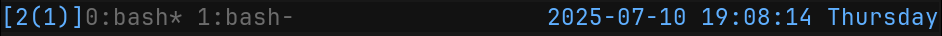
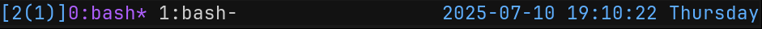

- TC
{:toc}

# Tmux Configuration

## Overview

You can copy the provided configuration file to `~.tmux.conf` or `~/.config/tmux/tmux.conf` and use it directly. It's a pretty standard configuration and it's short enough that we can walk through the whole thing, and you can change it to your taste.

Start by `sourcing` the [Example tmux.conf](./tmux.conf) into your current session:

1. Copy the example config file to `~/.tmux.conf` (or `~/.config/tmux/tmux.conf`). 
2. In your open session, execute `C-b :` to bring up the command prompt.
3. Type `source-file ~/.tmux.conf` and press `Enter`/`Return` to activate that configuration.

{: .note }
This config changes the `prefix` to `C-a`. Keep that in mind as you continue so you can translate any examples to the correct sequence.

The first customization I always make is to re-bind the `prefix` key. By default, it's `C-b` (`Ctrl+b`). That's kind of awkward to type, and feels like it's probably bad for your wrist (on a US QWERTY keyboard).

You may like to re-bind the `prefix` to something like `C-a` or even "\`" (backtick).

```text
unbind C-b
set -g prefix C-a
bind C-a send-prefix
```

Using `C-a` is a little more comfortable, doesn't typically conflict with other common keybindings, and matches the `prefix` idiom used by `gnu-screen`.

The idea behind using "\`" was that it was a single-key prefix, which makes it easy to type, and it's rarely typed in day-to-day work. If you do need to use it, you can hit "\`" twice in a row. However, I find myself writing a lot more `markdown` with code sections, or other applications where I actually need to use "\`". So I typically use `C-a` myself.

I also like to bind a key to `source` the configuration file to apply recent changes:

```text
unbind r
bind r source-file ~/.config/tmux/tmux.conf
```

I disable support for mouse selection and input, set the clock to 24-hour format, and set a large history limit. You may want to customize these:

```text
set  -g mouse             off
setw -g clock-mode-style  24
set  -g history-limit     50000
```

### Status Line

The `tmux` status-line shows a list of active windows in your session, and indicates which one is selected.

It can also be configured to show useful information about your command, session, or system environment.

```text
set -g status-style bg='#111111',fg='#676E7D'
set -g status-interval 1
set -g status-left '[#{session_name}] '
set -g status-right '%Y-%m-%d %T %A'
set-option -g status-position bottom
```

{:width="941" height="35"}

#### Format String

If you've ever [configured a prompt-string for your shell](../zsh_configuration/02_prompt), then you know how this works. Of course, `tmux` has it's own system and syntax, different from that of `zsh`. But, just like configuring your `zsh` prompt, you probably only need to do it one time, and it's not actually very hard.

You still supply a format-string, and certain characters and escape sequences will be replaced when the status line is rendered.

[Reference manual](https://www.man7.org/linux/man-pages/man1/tmux.1.html#FORMATS)

- Format variables are enclosed in `#{ ... }`. Example: `#{session_name}` would be replaced with the name of the current session.
- There is a ternary operator `${?VAR,TRUE,FALSE}`. Example: `#{?window_zoomed_flag,🔍,}` would show a magnifying glass icon if `zoom mode` is active, or nothing otherwise.
- Shell commands can be included in `#( ... )`. Example: `#(uptime)` would run the `uptime` command and render the output.
- Style sections of the status line with `#[STYLES]`. Example: `#[fg=FFFFFF bg=000000 bold]` would change the style to white foreground and black background, with bold text.
- Use the style `default` to reset to the default `status-style` colors from your configuration. Example: `#[default]`.

Show current date and day of the week, in a blue color:

```text
set -g status-right '#[fg=#4EA1FF]%Y-%m-%d %T %A'
# you might need to make the section max-width to make room
set -g status-right-length 40
```

Show the name of the current session (`#S`), the number of clients connected to the session in parentheses, in blue text. And show a magnifying glass on the left when `zoom mode` is active:

```text
set -g status-left '#[fg=#4EA1FF]#{?window_zoomed_flag,🔍,}[#S(#{session_attached})]'
# you might need to make the section max-width to make room
set -g status-right-length 20
```

{:width="942" height="36"}

The default styles and colors are set by the `status-style` option. When you use `#{default}` to reset styles, this is what it will use as the default.

You can also set a different style for the active session "tab" on the status line with `window-status-current-style`.

```text
set-option -g window-status-current-style fg=#BD5EFF
```

{:width="941" height="36"}

## tmux-send-keys

You can run a command from one shell, and have `tmux` type the arguments into another pane.

This is a cool trick and can be very useful for scripting or making custom keybindings to coordinate things between multiple panes.

1. Make sure you have at least one vertical split on your open `window` (`prefix "`).
2. Navigate to the top pane with `prefix ↑`.
3. Type the following command at the terminal:

```zsh
tmux send-keys -t {down-of} "ls -al" Enter
```

{:width="471" height="588"}

## Plugins and Alternatives

There are plugins for `tmux`, and even plugin managers. I've never used a `tmux` plugin myself but, if you are interested, [here is a list](https://github.com/tmux-plugins/list).

There are a few alternatives to `tmux` that are worth mentioning:

- `gnu-screen` (`screen`) is an older terminal multiplexer. It has fewer features, and doesn't support splitting screens into multiple `panes`, but you can have multiple `windows` and you can detach and re-attach to sessions. It's frequently found on development servers, where you connect remotely via `ssh`. If you work from within `screen`, then you can resume your session if the network connection is cut-off, or allow other users to join your session and pair.
- [`zellij`](https://github.com/zellij-org/zellij) is a newer, rust-based "workspace manager" that has many of the same features as `tmux`. I've never used it, but it seems to be quite popular.
- [`ghostty`](https://ghostty.org/) is a brand new terminal emulator that also allows you to make splits and `windows`, but no support for `sessions` (yet).

I prefer to use a terminal emulator that doesn't have splits or windows, like [kitty](https://sw.kovidgoyal.net/kitty/), and use that with `tmux` for layout management.

## References:

- `man tmux`
- [https://github.com/tmux/tmux/wiki](https://github.com/tmux/tmux/wiki)
- [https://github.com/tmux/tmux/wiki/Installing](https://github.com/tmux/tmux/wiki/Installing)
- [https://github.com/tmux/tmux/wiki/Getting-Started](https://github.com/tmux/tmux/wiki/Getting-Started)
- [https://tmuxreference.com/](https://tmuxreference.com/)

---

[HOME](../)
