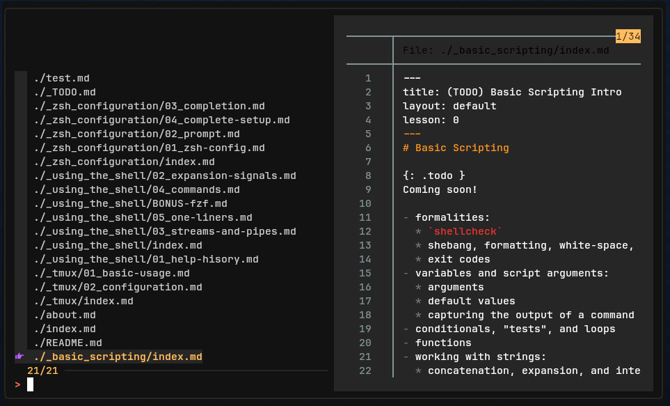

-----
--title: fzf and ripgrep
--lesson: 99
--layout: default
-----

# ripgrep, silverserver, fd

# bat

# jq

# pass

# task

# fzf and ripgrep

You can pipe any output into `fzf` and it will allow you to do a fuzzy search across all the lines in the input stream.



A "fuzzy" search will match things that are _similar_ to your query, and sorts the based on how close they are to your original query. This lets you find results more easily when don't remember the exact term or phrase you are looking for, or if you have typos that wouldn't be an exact match.

A common use of `fzf` is to search through a large directory listing for a specific file or directory, or to search for specific text across a large number of files.

`fzf` displays the listing of most relevant matches, which updates as you type your query. It can also be configured with a 'preview' window that can show a preview of the contents of the selected file.

Once you make your selection, `fzf` will print it out to `STDOUT`, which means you can redirect it to an output file, pipe it to another program, or use the output as an argument to another complex command.

## Using

- pipe anything into `| fzf` and then you can fuzzy search it
- uses somewhat regex-like search modifiers. single quotes indicate word boundaries, `^` and `$` anchor to start or end, invert with `!`. "or" together with `|`.
- if yo do something like `command | fzf > outfile` then it will save your selections to that text file when you are done
- shell integration:
    - `ctrl+t` - paste selected entries into the command line to complete a command
    - `ctrl+r` - paste selected command history entry to command line
    - `alt+c` - cd into selected directory
    - `**<TAB>` - trigger completion using `fzf` instead of zsh completion engine (`vim ~/test/**<TAB>`)
- in the finder:
    - `ctrl+k`/`ctrl+j` (or `ctrl+p`, `ctrl+n`) move cursor up and down
    - `enter` to select the item
    - `ctrl-c` / `ctrl-g` / `esc` to exit

## Configuring

- also install `ripgrep` and set `FZF_DEFAULT_COMMAND`:
    - `export FZF_DEFAULT_COMMAND='rg --files --hidden --glob *'`
    - `rg` will filter/exclude `.gitignore` files automatically
- add `eval "$(fzf --zsh)"` to `~/.zshrc`
    - optionally unset these keybindings with vars: `FZF_ALT_C_COMMAND= FZF_CTRL_T_COMMAND= fzf ...`
    - instead, set them to the same thing as `FZF_DEFAULT_COMMAND`
        - `export FZF_ALT_C_COMMAND="$FZF_DEFAULT_COMMAND"`
        - `export FZF_CTRL_T_COMMAND="$FZF_DEFAULT_COMMAND"`
- then `alias -- fzf="fzf --tmux"`
- export default options in `~/.zshrc` with `FZF_DEFAULT_OPTS`
    - `export FZF_DEFAULT_OPTS="--tmux "`
    - or `export FZF_DEFAULT_OPTS_FILE=~/.config/fzf/fzfrc` and use that file

I used a [theme designer](https://vitormv.github.io/fzf-themes/) to produce my configuration (uses a patched [nerd font](https://nerdfonts.com) for icons):

```zsh
export FZF_DEFAULT_OPTS=$FZF_DEFAULT_OPTS'
  --color=fg:#CCCCCC,fg+:#FFBD5E,bg:#121212,bg+:#262626
  --color=hl:#4EA1FF,hl+:#00a0fd,info:#FFBD5E,marker:#5EFF6C
  --color=prompt:#FF6E5E,spinner:#BD5EFF,pointer:#BD5EFF,header:#4EA1FF
  --color=border:#262626,preview-fg:#000000,preview-bg:#262626,label:#aeaeae
  --color=query:#d9d9d9
  --border="rounded" --border-label="" --preview-window="border-rounded" --prompt="> "
  --marker=">" --pointer="󰋇 " --separator="─" --scrollbar="│"'
```
