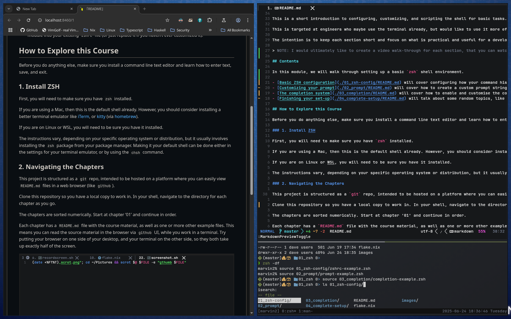

# DaveLab

- TC
{:toc}

## Overview

Short, guided crash-courses for important every day skills.

Each course is made of a small number of short sections (around 20 minutes each).

These lessons are intended to be interactive - work along in your terminal and do the examples as you read.

These short lessons can't teach you everything you need to be an expert. They will only cover the enough to get you off the ground, and give you an idea of how/why the topic is useful to you.

## Navigating the Chapters

Clone this repository so you have a local copy to work in. In your shell, navigate to the directory for each module as you go.

```text
git clone https://github.com/dczmer/davelab.git
```

Try putting your browser on one side of your desktop, and your terminal on the other side, so they both take up exactly half of the screen. Browse through the course material while you work along in the terminal at the same time.



Each section will briefly cover the material, then explain how you can try it out and experiment.

## Contents

- [ZSH Configuration](./zsh_configuration) - How to configure your `zsh` shell into something that makes it comfortable, visually appealing, and easier to use.
- [(WIP) Using the Shell](./using_the_shell) - Using the shell effectively for everyday tasks.
- (TODO) Basic Scripting
- [Using tmux](./tmux) - How to use `tmux` to manage multiple terminal sessions effectively.

---

[BEGIN >>](./zsh_configuration)
