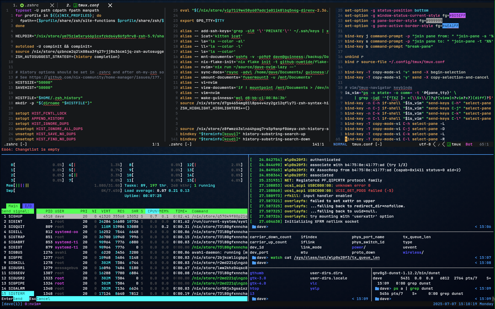

- TOC
{:toc}

# Heading 1
[Hello](#)

> A quote from someone wise.
> <cite>-- Marvin</cite>

{: .note }
A note!

{: .warning }
A warning!

{: .success }
A success!

| a    | b  | c    |
|------|----|------|
| dave | is | cool |
| dave | is | cool |
| dave | is | cool |
| dave | is | cool |

{: .caption }
**Table 1:** Sample data


<figure>
    <a href="./img/tmux.png" target="_blank">
        
    </a>
    <figcaption>A caption!</figcaption>
</figure>

---

- list1
- list2:
    * sub1


1. num1
2. num2:
    1. num3

## Heading 2

```python
print("HI")
```

### Heading 3

Blah blah blah blah blah.

```zsh
ls -all | grep boo
```

```python
import Beep from boop

GLOBAL: int = 1

class Test123():
    var123: str = "HI"

    # comment
    def fun123(arg1: int, arg: str) -> None:
        """ What's up docstring? """
        print(self.var123 + " dave")
        return None
```
hello
